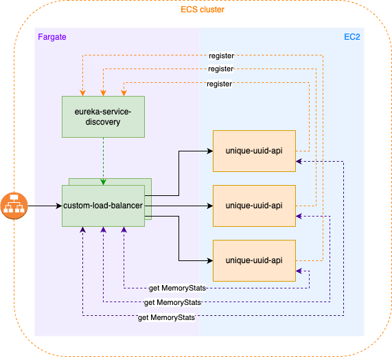
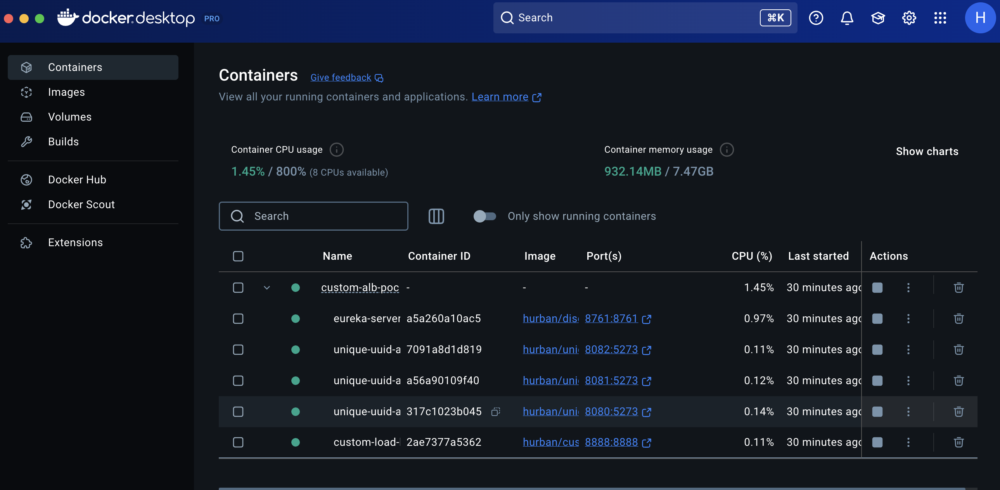
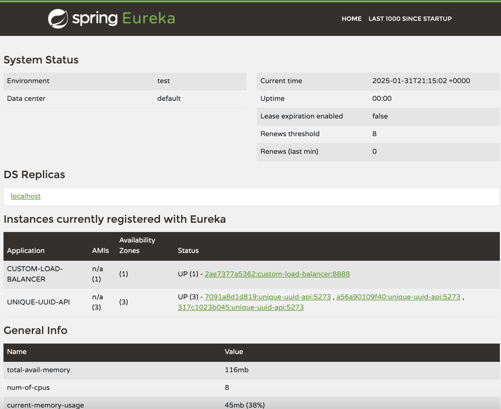
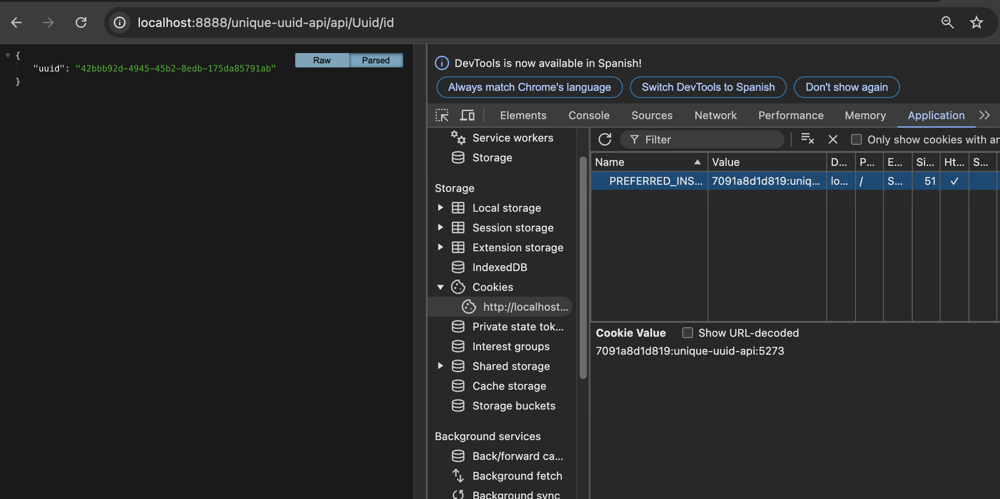
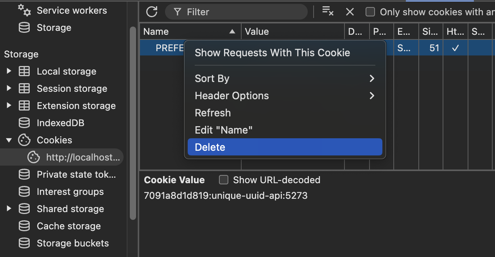

# custom-resources-alb
Custom load balancer based on memory usage and sticky session.



## Pre-requisites
Installed  
- .Net SDK 8.0.405 or latest
- Java JDK +17
- Docker Desktop 


## Build the projects
You can build the projects separately or you can build them all at once via a script.  
1. Build all at once
```bash
./build-all.sh
```
This script will build all the projects and create the docker images. If everything worked fine you will see a message as follows: `All projects have been built and images have been created successfully!`.  

## Run the projects
The easiest way to deploy the entire solution is through a docker-compose that contains all the configuration needed to validate this proof of concept.
To start the docker compose run the script:
```bash
./compose-up.sh
```



To stop the docker compose run the script `compose-down.sh`.  


## Test the solution
You can see the *unique-uuid-api* instances registered in eureka through the following link http://localhost:8761/
You should see something similar to the following:



For the next step I recommend using google chrome, but you can use any browser or client in which you can see the cookies. To see the cookies in chrome go to the developer tools option in the view menu, and in the applications tab you will see the cookies.

Next make a request to the load balancer to do a get http://localhost:8888/api/Uuid/id


All the following requests will fall on the same instance due to the cookie thanks to the _sticky session_.  
If you delete the cookie your next request could be directed to a new instance (or not), that will depend on the amount of free memory of the instances. If you have been sent to the same instance you can "emulate" that it is using memory by making the following request:
```bash
curl -X POST "http://localhost:8080/api/MemoryStats/consume"
```
You will see a response like this:
```
{"cpuPercentageUsage":0.05,"availableMB":3996,"usageMB":100,"limitMB":3072}
```

*Note that the port should be 8080, 8081 or 8082 depending of the instance you want to add memory usage in order to avoid been selected.

Delete Cookie:



Happy coding!

